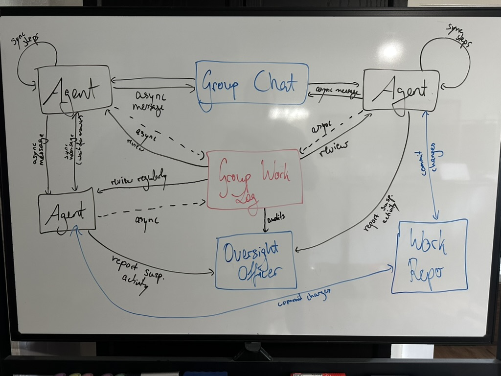

# Agenty - Self-Extending AI (Multi-)Agent System

This is an AI agent system that can self-extend by writing more tools for itself,
interact with files, execute Git commands, maintain conversation context across restarts,
and incorporate human feedback when needed.

An extension to support multiple agents working together is currently under way and completely experimental.
To start an agent in multi-agent mode, set TEAM_MODE in base_agent.py to true.
Team mode is still in development.

## Features

- File operations (read, edit, delete)
- Directory listing
- Git command execution
- Program restart with context preservation
- Context reset capability
- Human interaction and feedback loop
- Safety mechanisms to prevent excessive tool usage
- Self-extension capabilities
- Error logging and handling

## Getting Started

To start the AI agent system:

1. Ensure all dependencies are installed
2. If using a group-work-repository, create a local directory, initialise it with `git init`, run the git command `git config receive.denyCurrentBranch updateInstead` to allow push and run the clone_repo.sh script to clone the repository. 
You need also to change the USERNAME and PATH_TO_REPO variables in the script.
3. Provide an Anthropic API key in the `ANTHROPIC_API_KEY` environment variable
4. Run the main program file `agent/main.py`
5. Begin interacting with the agent through the provided interface

### Using Docker

You can also run the agent team using Docker. Only configuration steps needed are:

- The `ANTHROPIC_API_KEY` environment variable, also possible to be defined in an `.env` file next to the `docker-compose.yaml`.
- The `team-config.json` file, which should be adapted to your needs (provide a task and a team of agents).

Then you can use the agent team using the following scripts:

- `scripts/deploy_agent_team.sh`: Deploys the agent team using Docker Compose.
- `scripts/pause_agent_team.sh`: Pauses the agent team's work (by stopping their containers).
- `scripts/resumt_agent_team.sh`: Resumes the agent team's work (by starting their containers again).
- `scripts/undeploy_agent_team.sh`: Undeploys the agent team and cleans up Docker resources.

## Available Tools

The agent comes with several built-in tools:

- `read_file`: Read contents of a file, with optional line range specification
- `list_files`: List files in a directory
- `edit_file`: Create or modify files by replacing specified text
- `delete_file`: Remove files from the system
- `git_command`: Execute Git operations (add, commit, status, etc.)
- `restart_program`: Restart while preserving conversation context
- `reset_context`: Reset the conversation context and restart the program
- `ask_human`: Request information or confirmation from the human user
- `create_tool`: Create a new tool for the agent to use
- `calculator`: Perform basic arithmetic operations

## Multiple Agents - Target Architecture (Experimental)



## Safety Mechanisms

The agent includes several safety features:

- **Consecutive Tool Limit**: After 10 consecutive tool calls without human interaction, the agent is forced to check in with the human user
- **Error Logging**: Unhandled exceptions are logged to an error.txt file
- **Context Preservation on Error**: Conversation context is preserved when errors occur
- **Controlled Context Management**: Context can be explicitly reset when needed

## Self-Extension

The agent can extend its capabilities by:

1. Creating new Python modules with custom functionality
2. Integrating these modules with the main agent system
3. Registering new tools in the agent's function registry
4. Using these tools in future interactions by restarting the program

## Context Preservation and Management

The agent provides sophisticated context handling:

- **Preservation**: Saves the current conversation state to a pickle file during restarts
- **Restoration**: Reloads this state after restart to maintain continuity
- **Agent-Initiated Restarts**: Can restart itself while preserving context for operations requiring new tools
- **Context Reset**: Can explicitly reset conversation context when needed
- **Automatic Cleanup**: Context is automatically deleted on normal program exit

## Example Usage

```
User: Create a file called example.txt with "Hello World" in it
Agent: [Creates the file]

User: Read the contents of example.txt
Agent: The file contains: Hello World

User: Add a second line to the file
Agent: [Modifies the file]

User: I'm not sure what to do next
Agent: [Uses ask_human tool to request guidance]

User: Let's commit our changes to git
Agent: [Executes git command to commit the changes]

User: Restart the program
Agent: [Restarts while preserving context]
```
